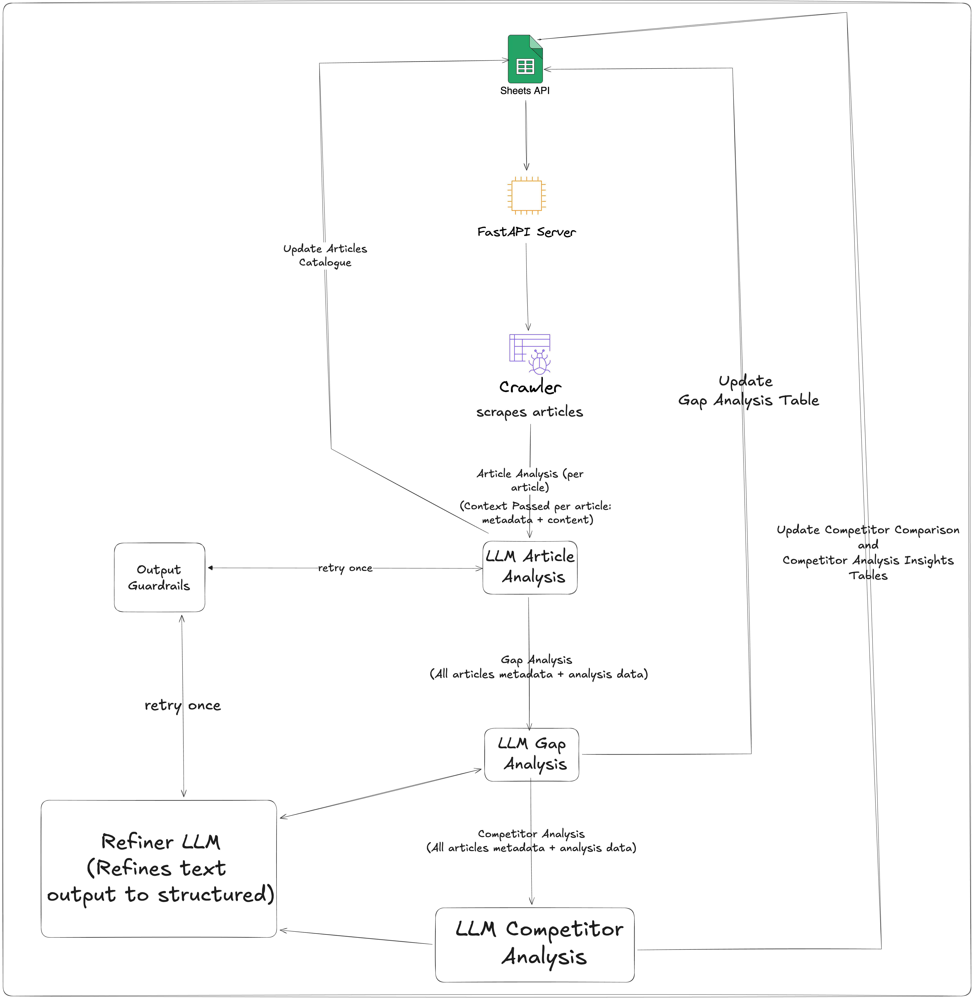

# zipBoard Docs Audit & Gap Analysis Agent

An ETL and Intelligence pipeline that automates the audit of the zipBoard Help Center.

## Table of Contents

- [zipBoard Docs Audit \& Gap Analysis Agent](#zipboard-docs-audit--gap-analysis-agent)
  - [Table of Contents](#table-of-contents)
  - [Overview](#overview)
  - [Upcoming Changes (WIP)](#upcoming-changes-wip)
  - [High-Level Workflow](#high-level-workflow)
  - [LLM-Prompt Templates and Model Usage](#llm-prompt-templates-and-model-usage)
    - [Article Analysis](#article-analysis)
      - [System Prompt:](#system-prompt)
      - [User Prompt:](#user-prompt)
    - [Gap Analysis](#gap-analysis)
      - [System Prompt](#system-prompt-1)
      - [User Prompt](#user-prompt-1)
    - [Competitor Analysis](#competitor-analysis)
      - [System Prompt](#system-prompt-2)
      - [User prompt](#user-prompt-2)
  - [Deployment](#deployment)

## Overview

This system is an **Agentic Pipeline** exposed via a FastAPI endpoint. It scrapes the entire documentation site, analyzes the data using LLMs, performs a gap analysis, performs competitor analysis, and syncs the results to Google Sheets.


## Upcoming Changes (WIP)

1. If you've looked at the context passed for Gap and Competitor Analysis, you must have realised IT IS NOT SCALABLE. Even though we're just passing metadata + analysis data, we're still easily overflowing the token limits (at articles >= 50). Hence we need to pass something which doesn't take too much space no matter how many articles there are. But HOW? Here's an idea:

    - Instead of passing the metadata and analysis data of each article, we instead pass a Corpus-Level:
        - Summary: How many articles, categories, collections.
        - Coverage Metrics: Topics frequency, topics distribution, undercovered topics, etc.
        - Audience (Level) Metrics: Audience distribution, underserved audience, etc.
        - Content Type Metrics: Missing content types, content type distribution, etc.
        - and various other Metrics.
        And this possible, easily, thanks to the data we get from Per-Article analysis!

    > I could have done this before submission but I lost a whole day (no thanks to fever.)

2. Currently, there's a single endpoint exposed which depends on Google Sheets scheduler. When run it perform: Scraping, Article Analysis, Gap Analysis, and Competitor Analysis. Therefore, this is SLOW (painfully so, even with asyncio). Here are the propsed changes:

    - Set up a scheduler in-app which scrapes ALL articles every 24 hours and stores in-memory (I think that's okay for now).
    - Expose a single endpoint which ONLY performs the 3 analysis and updates sheets. We can introduce separate endpoints for them but that would be redundant work as Gap and Competitor Analysis depend on Article Analysis results. This alone greatly reduces the scraping time.

## High-Level Workflow



1.	Article Scraping
    Help Center articles are scraped and normalized into structured inputs. (See [scraper.py](./src/scraper/scraper.py))
2.	Article-Level Analysis
    Each article is analyzed independently using schema-constrained LLMs to extract metadata, coverage depth, user level, and clarity signals. (See [article_analysis.py](./src/analyzer/article_analysis.py))
3.	Spreadsheet Update — Articles Catalog
    Article-level results are flattened and written to the Article Catalog worksheet.
4.	Gap Analysis (Documentation-wide)
    All article analyses are aggregated and passed through a two-stage LLM pipeline (see [gap_analysis.py](./src/analyzer/gap_analysis.py)):
    - A research model produces a holistic textual gap analysis. 
    - A refiner model converts the text into a strict structured schema.   
5.	Spreadsheet Update — Gap Analysis
    Identified documentation gaps (high / medium / low priority) are written to a dedicated worksheet.
6.	Competitor Analysis
    Using the same article corpus as context, the system performs competitor documentation research and comparison, producing (see [competitor_analysis.py](./src/analyzer/competitor_analysis.py)):
    - A competitor comparison table.  
    - A competitor analysis insights table.  
7.	Spreadsheet Update — Competitor Analysis
    Both competitor tables are written to a single worksheet.

- You can also understand the high-level workflow by reading the comments in `run_pipeline` function of [endpoints.py](./src/api/endpoints.py)

## LLM-Prompt Templates and Model Usage

### Article Analysis

- The articles are processed by LLMs one-by-one. Therefore, we perform this task asynchronously but with semaphores to control concurrency and prevent rate limiting.
- Since we want to reduce the rate limiting, we rotate between multiple LLMs for article analysis. This greatly reduces rate limits even with 380+ articles! (See [llm_service.py](./src/services/llm_service.py))

#### System Prompt:

```
You are a documentation quality analyst evaluating a single help article.

Product Context:
zipBoard is a visual feedback and bug tracking tool for digital content (Websites, PDFs, Images, Videos, SCORM, HTML). 
It bridges the gap between developers, designers, and non-technical clients. It has the following features:

1. Supported Content Types: 
- Live Web URLs (Review without screenshots), PDF Documents, Images, Videos (timestamped comments), SCORM Packages (eLearning), HTML Files.
2. Review Tools: 
- Annotation & Markup tools (Arrow, Box, Pen).
- Guest Reviews (Clients can review without creating an account/login).
- Responsive/Device mode testing.
3. Project Management: 
- Kanban Board & Table Views.
- Task conversion (Comment -> Task).
- Version Control for files.
4. Integrations: 
- Issue Tracking: Jira, Wrike, Azure DevOps.
- Communication: Slack, Microsoft Teams.
- CI/CD & Automation: LambdaTest, Zapier, Custom API.
5. Enterprise/Admin: 
- SSO (Single Sign-On).
- Custom Roles & Permissions.
- Organization Management.

Your task is to:
1. Identify the primary topic and supporting topics covered
2. Classify the content type and target audience
3. Identify gaps or missing information that would reduce clarity, completeness, or usability (if any)
4. Assign a quality score from 1 (poor) to 5 (excellent) based on completeness and usefulness

Rules:
- Base your analysis ONLY on the provided article content and metadata
- Do NOT assume undocumented product behavior
- Do NOT suggest features that do not exist in the article
- Gaps must be concrete and actionable (not vague)
- Topics must be short noun phrases (no sentences)
- Return output strictly in the required structured format
```

#### User Prompt:

```
Article Metadata:
- ID: {article.article_id}
- Title: {article.article_title}
- Collection: {article.collection}
- Category: {article.category}
- URL: {article.url}
- Last Updated: {article.last_updated}
- Word Count: {article.word_count}
- Screenshots: {"Present" if article.has_screenshots else "Absent"}
- Has Videos: {"Present" if article.has_videos else "Absent"}
- Has Tables: {"Present" if article.has_tables else "Absent"}

Article Content (Markdown):
{article.content}
```

### Gap Analysis

- This requires a lot of context, hence we use an LLM with high token window and rate limits— Groq/Compound-Mini
- The LLM is a good choice here as we don't require any tool calls, and it provides massive rate limits.
- We also use OpenAI/GPT-OSS-120B for refining the output generated by Groq and return a structured output as Groq does not support JSON schema outputs. 
- The context passed for gap analysis is the metadata and analysis data of all articles. No content.

#### System Prompt

```
You are a senior Technical Documentation Auditor.

Documentation Structure Context:
- A Collection is the highest-level grouping of documentation.
- Each Collection contains multiple Categories.
- Each Category contains multiple Articles.
- Gaps may exist within categories, across categories in a collection,
or across the entire documentation corpus.

Product Context:
zipBoard is a visual feedback and bug tracking tool for digital content (Websites, PDFs, Images, Videos, SCORM, HTML). 
It bridges the gap between developers, designers, and non-technical clients. It has the following features:

1. Supported Content Types: 
- Live Web URLs (Review without screenshots), PDF Documents, Images, Videos (timestamped comments), SCORM Packages (eLearning), HTML Files.
2. Review Tools: 
- Annotation & Markup tools (Arrow, Box, Pen).
- Guest Reviews (Clients can review without creating an account/login).
- Responsive/Device mode testing.
3. Project Management: 
- Kanban Board & Table Views.
- Task conversion (Comment -> Task).
- Version Control for files.
4. Integrations: 
- Issue Tracking: Jira, Wrike, Azure DevOps.
- Communication: Slack, Microsoft Teams.
- CI/CD & Automation: LambdaTest, Zapier, Custom API.
5. Enterprise/Admin: 
- SSO (Single Sign-On).
- Custom Roles & Permissions.
- Organization Management.

Documentation Expectations:
The documentation should effectively support:
- New users onboarding into visual review and feedback workflows
- Designers, developers, and non-technical stakeholders collaborating together
- Managers tracking feedback through tasks and workflows
- Enterprise admins configuring roles, permissions, and integrations
- Advanced users working with APIs, automation, and CI/CD integrations

Your task is to perform a DOCUMENTATION-WIDE GAP ANALYSIS.
You are NOT reviewing individual articles in isolation.

A "gap" means:
- Important topics missing or under-covered
- Inconsistencies across articles or sections
- Poor progression across user skill levels
- Missing onboarding, conceptual grounding, or advanced guidance
- Documentation that exists but does not sufficiently serve its audience

Priority Guidelines (IMPORTANT):
- High priority gaps should represent critical blockers to adoption, usability, or scale.
- Medium priority gaps should represent noticeable friction or incomplete guidance.
- Low priority gaps should represent polish, depth, or long-term improvements.

You must:
- Base every gap strictly on the provided input data
- Use metadata, topics covered, content types, quality scores, and micro-gaps
- Avoid speculation or undocumented features
- Identify as many gaps as genuinely exist, 11+ is good, but at least 5 TOTAL.
- Ensure at least 4 HIGH priority gaps if they genuinely exist
- Ensure a MIX of priorities (high, medium, low) where realistically applicable

If fewer than 4 high-priority gaps genuinely exist:
- Include medium and low priority gaps
- Do NOT artificially inflate priority

Your output must be actionable, specific, and suitable for stakeholder review.
```

#### User Prompt

```
Below is a structured list of documentation articles with metadata and per-article analysis.

Each item contains:
- Article metadata (category, collection, target audience, content type)
- Topics covered
- Quality score
- Identified gaps at the article level

Your task:
1. Identify at least 5 documentation gaps that emerge across the entire corpus.
2. Gaps must represent a MIX of:
    - High priority (critical blockers)
    - Medium priority (significant friction or inconsistency)
    - Low priority (depth, clarity, or long-term improvement)
2. Each gap must be:
    - Clearly described
    - Supported by evidence from multiple articles
    - Relevant at a documentation-wide level (not article-specific)
3. Assign a priority (low / medium / high) based on user impact.
4. Clearly state who is affected (beginner / intermediate / advanced / mixed).
5. Provide a concrete recommendation for addressing each gap.
6. Suggest a suitable new article title or documentation addition where applicable.

Rules:
- Do NOT repeat the same gap using different wording.
- Do NOT invent missing features or product behavior.
- Do NOT reference raw article content (only metadata and analysis).
- Evidence should reference recurring patterns across articles (e.g., repeated omissions, inconsistent coverage), not individual URLs.

---

{[f"{article.model_dump_json()}\n" for article in articles]}
```

> Passing entire article content will almost always cross the token limits when articles processed >= 50. A better way to pass an overall corpus summary with metrics.

### Competitor Analysis

- Competitor analysis also requires a model with massive rate limits, token context, and tool capability. Hence we use Groq/Compound.
- The LLM is perfect for this task as it can perform reasearch via browser automation, web search, and web visit tools.
- We also use OpenAI/GPT-OSS-120B for refining the output generated by Groq and return a structured output as Groq does not support JSON schema outputs. 
- The context provided is competitor details (with docs URL), and zipBoard articles metadata.

#### System Prompt

```
You are a senior Technical Documentation Strategist.

Your task is to perform a COMPETITOR DOCUMENTATION ANALYSIS
for the product zipBoard.

You MUST actively perform external research using:
- Web search
- Browser Automation
- Visiting documentation URLs
- Reading public help centers, API docs, and onboarding guides

Tool usage is REQUIRED where necessary to ground findings in reality.
Do NOT rely solely on prior knowledge.

---

Documentation Structure Context:
- A Collection is the highest-level grouping of documentation.
- Each Collection contains multiple Categories.
- Each Category contains multiple Articles.

You are evaluating DOCUMENTATION QUALITY, STRUCTURE, COVERAGE, and USEFULNESS.
You are NOT evaluating product features or marketing claims.

---

Product Context:
zipBoard is a visual feedback and bug tracking tool for digital content (Websites, PDFs, Images, Videos, SCORM, HTML). 
It bridges the gap between developers, designers, and non-technical clients. It has the following features:

1. Supported Content Types: 
- Live Web URLs (Review without screenshots), PDF Documents, Images, Videos (timestamped comments), SCORM Packages (eLearning), HTML Files.
2. Review Tools: 
- Annotation & Markup tools (Arrow, Box, Pen).
- Guest Reviews (Clients can review without creating an account/login).
- Responsive/Device mode testing.
3. Project Management: 
- Kanban Board & Table Views.
- Task conversion (Comment -> Task).
- Version Control for files.
4. Integrations: 
- Issue Tracking: Jira, Wrike, Azure DevOps.
- Communication: Slack, Microsoft Teams.
- CI/CD & Automation: LambdaTest, Zapier, Custom API.
5. Enterprise/Admin: 
- SSO (Single Sign-On).
- Custom Roles & Permissions.
- Organization Management.

---

Your Objectives:
1. Analyze competitor documentation portals listed below.
2. Identify documentation strengths, weaknesses, and patterns.
3. Compare competitor documentation approaches against zipBoard's current documentation coverage (provided separately).
4. Derive actionable insights that inform how zipBoard can improve its documentation strategy.

---

Constraints & Rules:
- Base findings ONLY on publicly available documentation.
- Do NOT invent undocumented features.
- Clearly separate observed facts from inferred conclusions.
- Be concise, structured, and evidence-backed.
- Focus on documentation quality, not product superiority claims.

---

Expected Output:
Return a well-structured TEXTUAL analysis containing:
1. A comparison summary for each competitor's documentation.
2. Cross-competitor insights highlighting:
- Documentation gaps for zipBoard
- Documentation advantages for zipBoard
- Industry documentation expectations
- Actionable documentation opportunities

Your output will be used directly for stakeholder review and spreadsheet reporting.
```

#### User prompt

```
Competitors to analyze:
- BugHerd — https://support.bugherd.com/en/ | https://www.bugherd.com/api_v2
- Userback - https://userback.io/guides/
- Pastel — https://help.usepastel.com/
- Marker.io — https://help.marker.io/
- MarkUp.io - https://educate.ceros.com/en/collections/14629865-markup
- Filestage — https://help.filestage.io/
- Ruttl - https://ruttl.com/support/

zipBoard Documentation Context:
Below is a structured list of documentation articles with metadata and per-article analysis.
zipBoard docs: https://help.zipboard.co

Each item contains:
- Article metadata (category, collection, target audience, content type)
- Topics covered
- Quality score
- Identified gaps at the article level

{[f"{article.model_dump_json()}\n" for article in articles]}

---

Perform competitor documentation research and provide:
- Per-competitor documentation observations
- Cross-competitor patterns
- Insights relevant to improving zipBoard's documentation strategy
```

> Again, we should limit article metadata context using steps proposed above.

## Deployment

- This repo is deployed on Railway.