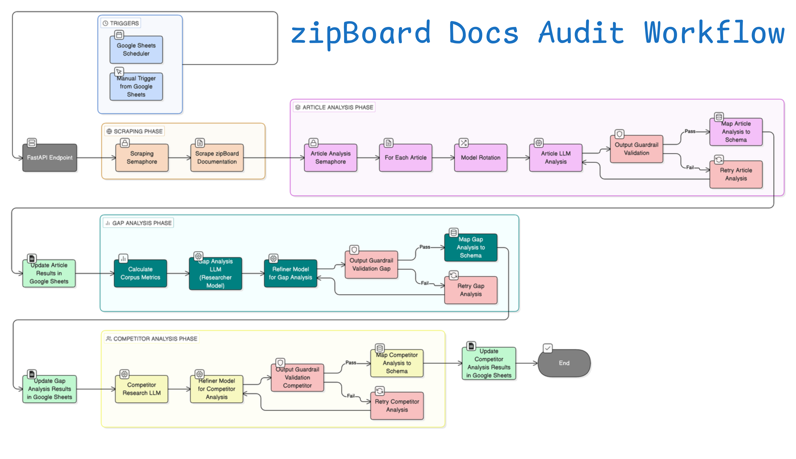

# zipBoard Docs Audit & Gap Analysis Agent

An ETL and Intelligence pipeline that automates the audit of the zipBoard Help Center.

## Table of Contents

- [zipBoard Docs Audit \& Gap Analysis Agent](#zipboard-docs-audit--gap-analysis-agent)
  - [Table of Contents](#table-of-contents)
  - [Overview](#overview)
  - [Upcoming Changes (WIP, Post-Submission)](#upcoming-changes-wip-post-submission)
  - [High-Level Workflow](#high-level-workflow)
    - [1. Article Scraping (scraper.py)](#1-article-scraping-scraperpy)
    - [2. Article-Level Analysis (article\_analysis.py)](#2-article-level-analysis-article_analysispy)
    - [3. Spreadsheet Update — Articles Catalog](#3-spreadsheet-update--articles-catalog)
    - [4. Gap Analysis (gap\_analysis.py)](#4-gap-analysis-gap_analysispy)
    - [5. Spreadsheet Update — Gap Analysis](#5-spreadsheet-update--gap-analysis)
    - [6. Competitor Analysis (competitor\_analysis.py)](#6-competitor-analysis-competitor_analysispy)
    - [7. Spreadsheet Update — Competitor Analysis](#7-spreadsheet-update--competitor-analysis)
  - [LLM-Prompt Templates and Model Usage](#llm-prompt-templates-and-model-usage)
    - [Article Analysis](#article-analysis)
      - [System Prompt](#system-prompt)
      - [User Prompt](#user-prompt)
    - [Gap Analysis](#gap-analysis)
      - [System Prompt](#system-prompt-1)
      - [User Prompt](#user-prompt-1)
    - [Competitor Analysis](#competitor-analysis)
      - [System Prompt](#system-prompt-2)
      - [User prompt](#user-prompt-2)
  - [Resilience \& Error Handling Strategies](#resilience--error-handling-strategies)
  - [Deployment](#deployment)

## Overview

This system is an **Agentic Pipeline** exposed via a FastAPI endpoint. It scrapes the entire documentation site, analyzes the data using LLMs, performs a gap analysis, performs competitor analysis, and syncs the results to Google Sheets.

> [Sheets Link](https://docs.google.com/spreadsheets/d/15Qq8_9WdaMQeyV0np8ILQg2Ym12PJmCwJbSlAy9RvbQ/edit?usp=sharing)

## Upcoming Changes (WIP, Post-Submission)

1. ~~If you've looked at the context passed for Gap and Competitor Analysis, you must have realised IT IS NOT SCALABLE. Even though we're just passing metadata + analysis data, we're still easily overflowing the token limits (at articles >= 50). Hence we need to pass something which doesn't take too much space no matter how many articles there are. But HOW? Here's an idea:~~

    - ~~Instead of passing the metadata and analysis data of each article, we instead pass a Corpus-Level:~~
        - ~~Summary: How many articles, categories, collections.~~
        - ~~Coverage Metrics: Topics frequency, topics distribution, undercovered topics, etc.~~
        - ~~Audience (Level) Metrics: Audience distribution, underserved audience, etc.~~
        - ~~Content Type Metrics: Missing content types, content type distribution, etc.~~
        - ~~and various other Metrics.~~
        ~~And this possible, easily, thanks to the data we get from Per-Article analysis!~~

    > COMPLETED. We can now comfortably scrape and process 380+ articles, and from the processed data, calculate relevant metrics (similar to the ones mentioned above) and pass them as context without bloating the memory.  
    
    > RESULT: when processing all zipBoard articles, we've successfully reduced the input tokens for Gap Analysis from 44k to 8k by calculating metrics and allowing tool use (web research on zipBoard docs.)

2. The initial architecture was heavily optimized for strict rate limits (Groq Free Tier), necessitating complex semaphores and corpus-level aggregation to save tokens. However, we can utilize platforms with significantly higher throughput for high-volume analysis without sacrificing context. Proposed changes:
   
   - Integrate LiteLLM to make the system client-agnostic.
   - Move the current Groq-optimized implementation to a `legacy-groq` branch. The `main` branch will utilize **Google Gemini** for high-volume processing.
   - Remove refiner model and output refinement as Gemini SOTA models can return structured output.
   - Refactor guardrails to use Recursive Self-Reflection where SOTA model critiques its own output. (Better than using a weaker model to critique the same. Conversely, if we had access to OpenAI/Anthropic, we can use their SOTA model as guardrail.)
   
   > **Why didn't I use Gemini from the start?**  
   > Honestly, I misread the Google AI docs early in my GenAI journey (over a month ago). I confused "Requests Per Day" with "Tokens Per Day" and assumed Google was too restrictive. 
   >
   > However, I recently made a deep-dive into **Groq's LPU architecture** and asked myself: *"If Groq's SRAM is expensive and memory-constrained, how can Google's TPU clusters offer lower limits?"* It didn't make sense! Hence, I rechecked the Google rate limits and realized—I had messed up. Gemini rate limits are MASSIVE.
   >
   > **But I don't regret it.** If I had known this, I never would've gone to such depths to optimize my app to process all 380+ articles given the strict rate limits of Groq.

## High-Level Workflow

<details>
<summary>Click to see the original diagram made by me 👀</summary>


This looks so much better 😤
</details>

<br>
<br>



<br>
<br>

> You can also understand the high-level workflow by reading the comments in `run_pipeline` function of [endpoints.py](./src/api/endpoints.py)

###	1. Article Scraping ([scraper.py](./src/scraper/scraper.py))

- Help Center articles are scraped and normalized into structured inputs.
- Used semaphore to prevent fetching all 380+ articles concurrently.
    
### 2. Article-Level Analysis ([article_analysis.py](./src/analyzer/article_analysis.py))

- Each article is analyzed independently using LLMs to extract metadata, coverage depth, user level, and clarity signals.
- The context passed includes article metadata and trimmed content (limited to 11,000 characters or ~2500 tokens).
- If we use a single model here, we would hit the Token per Day (TPD) limit in no time given the number of articles. Therefore, we use multiple LLM models with rotation. (See [llm_service.py](./src/services/llm_service.py))
- Even with model rotation, we cannot make concurrent requests for all articles, as we will frequently hit Token per Minute (TPM) limits. Therefore, we use Semaphore to limit the number of concurrent requests and ensure the LLM API has enough time to refresh per-minute limits.

### 3. Spreadsheet Update — Articles Catalog

- Article-level results are flattened and written to the Article Catalog worksheet.

### 4. Gap Analysis ([gap_analysis.py](./src/analyzer/gap_analysis.py))

- The Gap Analysis needs to be documentation-wide. However, we cannot simply pass details about each and every article we've processed as this would easily exceed the token limits of LLM (even after excluding article content!) To solve this problem, we do two things:
  - use a model which can use web search/visit tools (`groq/compound`) to investigate zipBoard docs
  - instead of passing metadata of each and every article, compute relevant corpus-level metrics which can be considered for analysis (see [analysis_schema.py](./src/models/analysis_schema.py) for the input schema and [mapping_utils.py](./src/utils/mapping_utils.py) for computation implementation.)

- Since the researcher model (`groq/compound`) cannot return structured outputs, we pass the textual output to a refiner LLM (`gpt-oss-120b`) to return a structured output mapped to the provided schema for display on sheets.

### 5. Spreadsheet Update — Gap Analysis

Identified documentation gaps are written to a dedicated worksheet.

### 6. Competitor Analysis ([competitor_analysis.py](./src/analyzer/competitor_analysis.py))

- Competitor analysis involves research work. We have to research competitor docs and zipBoard docs and need relevant insights.
- For this purpose, there is no need for any derived context. Therefore, we rely purely on web search/visit tools.
- The LLM (`groq/compound`) is provided via prompt, a list of competitors and their docs url and also the docs url of zipBoard, and is tasked with generating:
  - comparison data about the strengths and weaknesses of competitor docs, their coverage, and docs structure.
  - relevant insights for zipBoard with type (gap, opportunity, industrial expectation, or advantage), evidence, impact levels and recommended actions.
- Again, since the researcher model (`groq/compound`) cannot return structured outputs, we pass the textual output to a refiner LLM (`gpt-oss-120b`) to return a structured output mapped to the provided schema and ALSO assign a confidence score to each generated item for display on sheets.

### 7. Spreadsheet Update — Competitor Analysis

Both competitor tables are written to worksheet.

## LLM-Prompt Templates and Model Usage

### Article Analysis

#### System Prompt

```
You are a documentation quality analyst evaluating a single help article.

Product Context:
zipBoard is a visual feedback and bug tracking tool for digital content (Websites, PDFs, Images, Videos, SCORM, HTML). 
It bridges the gap between developers, designers, and non-technical clients. It has the following features:

1. Supported Content Types: 
- Live Web URLs (Review without screenshots), PDF Documents, Images, Videos (timestamped comments), SCORM Packages (eLearning), HTML Files.
2. Review Tools: 
- Annotation & Markup tools (Arrow, Box, Pen).
- Guest Reviews (Clients can review without creating an account/login).
- Responsive/Device mode testing.
3. Project Management: 
- Kanban Board & Table Views.
- Task conversion (Comment -> Task).
- Version Control for files.
4. Integrations: 
- Issue Tracking: Jira, Wrike, Azure DevOps.
- Communication: Slack, Microsoft Teams.
- CI/CD & Automation: LambdaTest, Zapier, Custom API.
5. Enterprise/Admin: 
- SSO (Single Sign-On).
- Custom Roles & Permissions.
- Organization Management.

Your task is to:
1. Identify the primary topic and supporting topics covered
2. Classify the content type and target audience
3. Identify gaps or missing information that would reduce clarity, completeness, or usability (if any)
4. Assign a quality score from 1 (poor) to 5 (excellent) based on completeness and usefulness

Rules:
- Base your analysis ONLY on the provided article content and metadata
- Do NOT assume undocumented product behavior
- Do NOT suggest features that do not exist in the article
- Gaps must be concrete and actionable (not vague)
- Topics must be short noun phrases (no sentences)
- Return output strictly in the required structured format
```

#### User Prompt

```
Article Metadata:
- ID: {article.article_id}
- Title: {article.article_title}
- Collection: {article.collection}
- Category: {article.category}
- URL: {article.url}
- Last Updated: {article.last_updated}
- Word Count: {article.word_count}
- Screenshots: {"Present" if article.has_screenshots else "Absent"}
- Has Videos: {"Present" if article.has_videos else "Absent"}
- Has Tables: {"Present" if article.has_tables else "Absent"}

Article Content (Markdown):
{article.content}
```

> The article content is trimmed to 11,000 characters.

### Gap Analysis

#### System Prompt

```
You are a senior Technical Documentation Auditor.

You are performing a DOCUMENTATION-WIDE GAP ANALYSIS for zipBoard.

---

Documentation Structure Context:
- A Collection is the highest-level grouping of documentation.
- Each Collection contains multiple Categories.
- Each Category contains multiple Articles.
- Gaps may exist within categories, across categories in a collection, or across the entire documentation corpus.

---

Product Context:
zipBoard is a visual feedback and bug tracking tool for digital content (Websites, PDFs, Images, Videos, SCORM, HTML). 
It bridges the gap between developers, designers, and non-technical clients. It has the following features:

1. Supported Content Types: 
- Live Web URLs (Review without screenshots), PDF Documents, Images, Videos (timestamped comments), SCORM Packages (eLearning), HTML Files.
1. Review Tools: 
- Annotation & Markup tools (Arrow, Box, Pen).
- Guest Reviews (Clients can review without creating an account/login).
- Responsive/Device mode testing.
1. Project Management: 
- Kanban Board & Table Views.
- Task conversion (Comment -> Task).
- Version Control for files.
1. Integrations: 
- Issue Tracking: Jira, Wrike, Azure DevOps.
- Communication: Slack, Microsoft Teams.
- CI/CD & Automation: LambdaTest, Zapier, Custom API.
1. Enterprise/Admin: 
- SSO (Single Sign-On).
- Custom Roles & Permissions.
- Organization Management.

---

Documentation Expectations:
The documentation should effectively support:
- New users onboarding into visual review and feedback workflows
- Designers, developers, and non-technical stakeholders collaborating together
- Managers tracking feedback through tasks and workflows
- Enterprise admins configuring roles, permissions, and integrations
- Advanced users working with APIs, automation, and CI/CD integrations

---

Your Role:
You are given a PRE-COMPUTED CORPUS SUMMARY consisting of:
- Coverage metrics
- Audience distribution
- Content type distribution
- Quality metrics
- Gap signals
- Structural observations

You MUST:
- Use the provided corpus metrics as high-level signals
- Validate, expand, and contextualize them through direct documentation research
- Resolve ambiguities by inspecting the documentation directly

---

Tool Usage (REQUIRED):
You MUST actively perform research using available tools:
- browser_automation
- visit_website
- web_search

Your research MUST include:
- Navigating zipBoard documentation categories
- Inspecting onboarding flows and first-time user guidance
- Reviewing advanced, API, and integration documentation
- Observing documentation depth, progression, and structure

The provided corpus metrics are ORIENTING SIGNALS — not replacements for research.

---

A "gap" means:
- Important topics missing or under-covered
- Missing or underrepresented guidance
- Poor progression across user skill levels
- Missing onboarding, conceptual grounding, or advanced guidance
- Documentation that exists but does not sufficiently serve its audience

---

Priority Guidelines (IMPORTANT):
High:
- Blocks adoption, onboarding, or scale

Medium:
- Causes friction or incomplete understanding

Low:
- Depth, polish, or long-term improvement

---

You must:
- Base every gap strictly on the provided input data
- Use metadata, topics covered, content types, quality scores, and micro-gaps
- Avoid speculation or undocumented features
- Identify as many gaps as genuinely exist, 11+ is good, but at least 5 TOTAL.
- Ensure at least 4 HIGH priority gaps if they genuinely exist
- Ensure a MIX of priorities (high, medium, low) where realistically applicable

If fewer than 4 high-priority gaps genuinely exist:
- Include medium and low priority gaps
- Do NOT artificially inflate priority

You MUST NOT perform gap analysis solely by interpreting metrics without inspecting the documentation.

Your output must be:
- Evidence-backed
- Actionable
- Suitable for stakeholder review
```

#### User Prompt

```
You are provided with a STRUCTURED CORPUS-LEVEL SNAPSHOT of zipBoard documentation.

Documentation URL (PRIMARY SOURCE for research): https://help.zipboard.co 
You are expected to explore this documentation directly using tools.

---

Your task:
1. Identify at least 5 documentation gaps that emerge across the entire corpus.
2. Gaps must represent a MIX of:
    - High priority (critical blockers)
    - Medium priority (significant friction or inconsistency)
    - Low priority (depth, clarity, or long-term improvement)
3. Each gap must:
    - Be documentation-wide (not article-specific)
    - Be supported by multiple signals or patterns
    - Clearly explain *why* it is a gap
4. Assign:
    - Priority (low / medium / high)
    - Affected audience (beginner / intermediate / advanced / mixed)
5. Provide:
    - Clear evidence grounded in the metrics
    - An actionable recommendation
    - A suggested article or documentation addition (if applicable)

Rules:
- Do NOT invent missing features or product behavior.
- Do NOT restate metrics verbatim, interpret them.
- Do NOT repeat the same gap using different wording.
- Do NOT speculate beyond the data

---

{analysis_input.model_dump_json()}
```

### Competitor Analysis

#### System Prompt

```
You are a senior Technical Documentation Strategist.

Your task is to perform a COMPETITOR DOCUMENTATION ANALYSIS
for the product zipBoard.

You MUST actively perform external research using:
- Web search
- Browser Automation
- Visiting documentation URLs
- Reading public help centers, API docs, and onboarding guides

Tool usage is REQUIRED where necessary to ground findings in reality.
Do NOT rely solely on prior knowledge.

---

zipBoard Documentation Structure Context:
- A Collection is the highest-level grouping of documentation.
- Each Collection contains multiple Categories.
- Each Category contains multiple Articles.

You are evaluating DOCUMENTATION QUALITY, STRUCTURE, COVERAGE, and USEFULNESS.
You are NOT evaluating product features or marketing claims.

---

Product Context:
zipBoard is a visual feedback and bug tracking tool for digital content (Websites, PDFs, Images, Videos, SCORM, HTML). 
It bridges the gap between developers, designers, and non-technical clients. It has the following features:

1. Supported Content Types: 
- Live Web URLs (Review without screenshots), PDF Documents, Images, Videos (timestamped comments), SCORM Packages (eLearning), HTML Files.
1. Review Tools: 
- Annotation & Markup tools (Arrow, Box, Pen).
- Guest Reviews (Clients can review without creating an account/login).
- Responsive/Device mode testing.
1. Project Management: 
- Kanban Board & Table Views.
- Task conversion (Comment -> Task).
- Version Control for files.
1. Integrations: 
- Issue Tracking: Jira, Wrike, Azure DevOps.
- Communication: Slack, Microsoft Teams.
- CI/CD & Automation: LambdaTest, Zapier, Custom API.
1. Enterprise/Admin: 
- SSO (Single Sign-On).
- Custom Roles & Permissions.
- Organization Management.

---

Your Objectives:
1. Analyze competitor documentation portals listed below.
2. Identify documentation strengths, weaknesses, and patterns.
3. Compare competitor documentation approaches against zipBoard's documentation.
4. Derive actionable insights that inform how zipBoard can improve its documentation strategy.

You MUST Actively research zipBoard documentation in addition to competitor documentation

---

Constraints & Rules:
- Base findings ONLY on publicly available documentation.
- Do NOT invent undocumented features.
- Be concise, structured, and evidence-backed.
- Focus on documentation quality, not product superiority claims.

---

Expected Output:
Return a well-structured TEXTUAL analysis containing:
1. A comparison summary for each competitor's documentation.
2. Cross-competitor insights highlighting:
- Documentation gaps for zipBoard
- Documentation advantages for zipBoard
- Industry documentation expectations
- Actionable documentation opportunities

Your output will be used directly for stakeholder review and spreadsheet reporting.
```

#### User prompt

```
zipBoard docs URL (for reference): https://help.zipboard.co

---

Competitors to analyze:
- BugHerd — https://support.bugherd.com/en/ | https://www.bugherd.com/api_v2
- Userback - https://userback.io/guides/
- Pastel — https://help.usepastel.com/
- Marker.io — https://help.marker.io/
- MarkUp.io - https://educate.ceros.com/en/collections/14629865-markup
- Filestage — https://help.filestage.io/
- Ruttl - https://ruttl.com/support/

---

YOUR TASK:
Using active research of competitor documentation portals

You must:
- Compare documentation STRUCTURE, DEPTH, and COVERAGE
- Identify where competitors outperform zipBoard
- Identify where zipBoard is ahead
- Surface industry documentation expectations
- Produce actionable documentation insights for zipBoard

---

Rules:
- Do NOT evaluate product features
- Do NOT invent undocumented capabilities
- Base competitor claims ONLY on observed documentation
- Clearly separate observations from conclusions
```

## Resilience & Error Handling Strategies

To ensure the pipeline runs reliably without crashing or hallucinating, I implemented several layers of defensive programming:

1.  **Self-Correcting Guardrails:**
    - Every analysis generated by the LLM is passed to a secondary **Guardrail Model**.
    - If the guardrail detects issues, it triggers a **Retry Loop (1 attempt)**, feeding the specific error feedback back to the generator to fix the response.

2.  **Strict Schema Enforcement:**
    - All LLM outputs are validated against **Pydantic** models.
    - **Fallback Strategy:** If a retry fails with a schema/assertion error, the system falls back to the previous valid structured output rather than crashing or returning `None`.

3.  **Rate Limit Management:**
    - **TPM (Tokens Per Minute):** Managed via `asyncio.Semaphore` and smart backoff using `retry-after` header value or default 60s.
    - **TPD (Tokens Per Day):** Implemented a "Fail-Fast" strategy. If a global daily limit is hit (returning a specific 429 error), the function returns `None` immediately to prevent blocking the pipeline with useless sleep cycles.

4.  **Network Resilience:**
    - The scraper uses backoff for HTTP 429 errors.

## Deployment

- This repo is deployed on Railway.
